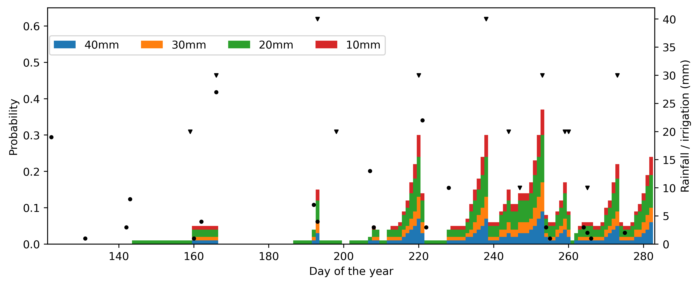

# Deep reinforcement learning for irrigation scheduling using high-dimensional sensor feedback
by [Yuji Saikai](https://yujisaikai.com), Allan Peake, and [Karine Chenu](https://researchers.uq.edu.au/researcher/1740)

&nbsp;

**Abstract**

Deep reinforcement learning has considerable potential to improve irrigation scheduling in many cropping systems by applying adaptive amounts of water based on various measurements over time. The goal is to discover an intelligent decision rule that processes information available to growers and prescribes sensible irrigation amounts for the time steps considered. Due to the technical novelty, however, the research on the technique remains sparse and impractical. To accelerate the progress, the paper proposes a general framework and actionable procedure that allow researchers to formulate their own optimisation problems and implement solution algorithms based on deep reinforcement learning. The effectiveness of the framework was demonstrated using a case study of irrigated wheat grown in a productive region of Australia where profits were maximised. Specifically, the decision rule takes nine state variable inputs: crop phenological stage, leaf area index, extractable soil water for each of the five top layers, cumulative rainfall and cumulative irrigation. It returns a probabilistic prescription over five candidate irrigation amounts (0, 10, 20, 30 and 40 mm) every day. The production system was simulated at Goondiwindi using the APSIM-Wheat crop model. After training in the learning environment using 1981-2010 weather data, the learned decision rule was tested individually for each year of 2011-2020. The results were compared against the benchmark profits obtained using irrigation schedules optimised individually for each of the considered years. The discovered decision rule prescribed daily irrigation amounts that achieved more than 96% of the benchmark profits. The framework is general and applicable to a wide range of cropping systems with realistic optimisation problems.

&nbsp;

**Prescribed daily irrigation probabilities**

Dots (●) and triangles (▼) represent daily rainfall and realised irrigation amounts respectively.
